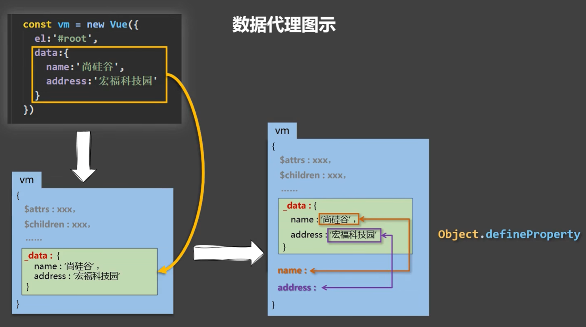
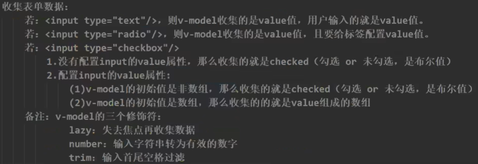

# 

中文文档：https://vuejs.bootcss.com/guide/

菜鸟教程：https://www.runoob.com/vue2/vue-tutorial.html

# 数据代理

> **Object.defineProperty(对象，属性名，配置)**

为一个对象添加一个属性，并指定键的值

```js
let number = 20;
let person = {
    name:'zs',
    sex:'man'
}

Object.defineProperty(person,'age',{
    value:18,	//添加一个age属性，值是18
    //enumerable:true,	//控制属性是否可以枚举，默认值是false
    //writable:true,	//控制属性是否可以被修改，默认值是false
    //configurable:true	//控制属性是否可以被删除，默认是false
    
    //当有人读取person的age属性时，就会触发get函数，必须有返回值
    get(){
        return number	//将number返回，则number修改时，age也会修改
    }
    
    //当有人修改person的age属性时，就会触发set函数，并且会收到要修改的具体值
    set(value){
    	number = value;
	}
})
```

> **什么是数据代理**

通过一个对象代理对另一个对象中的属性进行读写操作

```js
let per1 = {name:'zs'}
let per2 = {age:20}

Object.defineProperty(per2,'name',{
    get(){
        return per1.name
    },
    set(value){
        per1.name = value
    }
})
```

> **Vue 的数据代理**

创建的`data`对象中的属性和值，会被`Vue实例`所复制，然后在`vm.name和vm.address`这两个属性做数据代理。每次访问`vm.name`都会触发`getter`方法的`_data.name`，或者修改时触发`setter`方法。页面只有在`data`中的数据修改时才会重新渲染

1. Vue中的数据代理

   ​	通过vm对象来代理data对象中属性的操作

2. Vue中数据代理的好处

   ​	更加方便的操作data中的数据

3. 基本原理

   ​	通过`Object.defineProperty()`把data对象中所有的属性添加到vm上

   ​	为每一个添加到vm上的属性，都指定一个`getter/setter`

   ​	在getter/setter内部去操作读写data中的属性




# 计算属性

```js
<div id="app">
    <input type="text" v-model="firstName" placeholder="请输入姓"/><br>    
        <input type="text" v-model="lastName" placeholder="请输入名"/><br>
            你的姓名是：{{fullName}}
</div>


<script>
    new Vue({
        el:'#app',
        data:{
            firstName:'',
            lastName:'',
        },
        computed:{
            fullName:{
                get(){
                    return this.firstName + '-' + this.lastName
                },
                set(value){
                    ...
                }
            }
        }
	})
```

当只有get方法，不需要set方法的时候就可以简写：

计算属性`fullName`后的函数就是`getter`

```js
<div id="app">
    <input type="text" v-model="firstName" placeholder="请输入姓"/><br>    
        <input type="text" v-model="lastName" placeholder="请输入名"/><br>
            你的姓名是：{{fullName}}
</div>


<script>
    new Vue({
        el:'#app',
        data:{
            firstName:'',
            lastName:'',
        },
        computed:{
            fullName(){
                 return this.firstName + '-' + this.lastName
            }
        }
	})
```


# 监视属性

https://www.runoob.com/vue2/vue-watch.html

深度监视：

1. Vue中的`watch`默认不监测对象内部值的改变
2. 需要配置`deep:true`可以监测对象内部值改变
3. Vue自身可以监测对象内部值改变，但是`watch`默认不可以

```html
<div id="app">
    <p>a的值是:{{numbers.a}}</p>
    <p>b的值是:{{numbers.b}}</p>
    <Button @click="numbers.a++">点击a+1</Button>
    <Button @click="numbers.b++">点击b+1</Button>
</div>

<script>
    new Vue({
        el:'#app',
        data:{
            numbers:{
                a:1,
                b:1
            }
        },
        watch:{
            //监视对象中的某个属性的变化
            //只监视numbers的a属性
            'numbers.a':{
                handler(newValue,oldValue){
                    console.log(newValue,oldValue);
                }
            },
            //监视整个对象中所有属性的变化，而不是对象地址的变化
            //成为深度监视
            numbers:{
                //深度监视开关
                deep:true,
                handler(newValue,oldValue){
                    console.log('numbers改变了');
                }
            }
        }
    })
</script>
```

> 监视的简写形式

当只有一个`handler函数时`，就可以简写

```js
new Vue({
    el:'#app',
    data:{
        numbers:1
    },
    watch:{
        numbers(newValue,oldValue){
            console.log('numbers改变了');
        }
    }
})
```


# 计算属性/监视

`computed`和`watch`之间的区别：

1. `computed`能完成的功能，`watch`都可以完成
2. `watch`能完成的功能，`computed不一定可以完成`


1. 被`Vue`所管理的函数，最好写成普通函数，这样`this`的指向才是`vm`或者`组件实例对象`
2. 所有不被`Vue`管理的函数，如`定时器的回调函数、ajax的回调函数、Promise的回调函数等`，最好写成`箭头函数`，这样`this`的指向就是箭头函数外层的`vm`或`组件实例对象`


# 列表过滤

使用`watch`和`computed`过滤

```js
<div id="app">
    <input type="text" v-model="name" placeholder="请输入姓名"/>
    <ul>
        <li v-for="(p, index) in filPersons" :key="p.id">
            {{p.id}}-{{p.name}}--{{p.age}}--{{p.sex}}
        </li>
    </ul>
</div>


    <script>
        new Vue({
            el:'#app',
            data:{
                name:'',
                persons:[
                    {id:'001',name:'张三',age:18,sex:'男'},
                    {id:'002',name:'张三丰',age:19,sex:'男'},
                    {id:'003',name:'李四',age:20,sex:'女'},
                    {id:'004',name:'李克勤',age:25,sex:'男'},
                ],

            },
            //计算属性方式
            computed:{
                filPersons(){
                    return this.persons.filter((item)=>{
                        return item.name.indexOf(this.name) !== -1;
                    })
                }
            },
            methods:{
                
            },
            //侦听属性方式
            // watch:{
            //     name:{
            //         immediate:true,
            //         handler(value){
            //             this.filPersons = this.persons.filter(item=>{
            //                 return item.name.indexOf(value) !== -1;
            //             })
            //         }
            //     }
            // }
        })
        
    </script>
```


在过滤基础上增加排序：

```html
<div id="app">
    <input type="text" v-model="name" placeholder="请输入姓名"/>
    <button @click="changeSort(1)">降序</button>
    <button @click="changeSort(2)">升序</button>
    <button @click="changeSort(0)">原序</button>
    <ul>
        <li v-for="(p, index) in filPersons" :key="p.id">
            {{p.id}}-{{p.name}}--{{p.age}}--{{p.sex}}
        </li>
    </ul>
</div>


    <script>
        new Vue({
            el:'#app',
            data:{
                name:'',
                persons:[
                    {id:'001',name:'张三',age:18,sex:'男'},
                    {id:'002',name:'张三丰',age:30,sex:'男'},
                    {id:'003',name:'李四',age:22,sex:'女'},
                    {id:'004',name:'李克勤',age:25,sex:'男'},
                ],
                sortType:0
            },
            computed:{
                filPersons(){
                    let arr =  this.persons.filter((item)=>{
                        return item.name.indexOf(this.name) !== -1;
                    })
                    if (this.sortType) {
                        arr.sort((p1,p2)=>{
                            return this.sortType === 1?p2.age - p1.age:p1.age-p2.age
                        })
                    }
                    return arr
                }
            },
            methods:{
                changeSort(value){
                    this.sortType = value
                }
            },
            // watch:{
            //     name:{
            //         immediate:true,
            //         handler(value){
            //             this.filPersons = this.persons.filter(item=>{
            //                 return item.name.indexOf(value) !== -1;
            //             })
            //         }
            //     }
            // }
        })
        
    </script>
```


# Vue.set()

在vue运行之后，向`data`中的某个属性中添加键值，将不会被vue所检测到，所以页面也不会有响应，因为添加的属性没有`get/set`方法，只是一个普通的属性，如果想要在运行之后添加属性需要用到`Vue.set方法()`：

```
Vue.set(目标对象，键，值)
```

目标对象就是`data`中的属性、键值就是想添加的键值

如：

```
Vue.set(vm._data.student,'sex','男')
```

或者:

```
vm.$set(vm._data.student,'sex','男')
```


# Vue监视数据原理

1. vue会监视`data`中所有层次的数据。

2. 如何监视对象中的数据

   1. 通过`setter`实现监视，且要在`new Vue`时，就传入要检测的数据。

      ​		对象中后追加的属性，Vue默认不做响应式处理

      ​		如果需要给后添加的数据做响应式，需要使用以下API

      ​				`Vue.set(target,propertyName/index,value)`

      ​				`vm.$set(target,propertyName/index,value)`

3. 如果监视数组中的数据
   1. 通过包裹数组更新元素的方法实现，本质就是做了两件事
      1. 调用原生数组方法对数组进行更新
      2. 重新解析模板，进而更新页面
4. 在Vue中修改修改数组中的某个元素一定要使用如下方法：
   1. `push()、pop()、shift()、unshift()、splice()、sort()、reverse()`
   2. `Vue.set`或`vm.$set`

注意：Vue.set和 vm.$set 不能给 vm 或者 vm 的根数据对象(vm._data) 添加属性


# 表单v-model




```html
    <div id="app">
        <form @submit.prevent="tijiao">
            <label for="username">账号:</label>
            <input type="text" id="username" v-model="userInfo.username"></input>
            <label for="password">密码:</label>
            <input type="number" id="password" v-model.number="userInfo.password"></input><br/>
            性别:
            <label for="male">男</label>
            <input type="radio" id="male" name="sex" v-model="userInfo.sex" value="male"></input>
            <label for="fmale">女</label>
            <input type="radio" id="fmale" name="sex" v-model="userInfo.sex" value="female"></input>
            <br>
            爱好:
            <label for="smoke">抽烟</label>
            <input type="checkbox" id="smoke" name="hobby" v-model="userInfo.hobby" value="抽烟"></input>
            <label for="drink">喝酒</label>
            <input type="checkbox" id="drink" name="hobby" v-model="userInfo.hobby" value="喝酒"></input>
            <label for="hale">烫头</label>
            <input type="checkbox" id="hale" name="hobby" v-model="userInfo.hobby" value="烫头"></input>
            <br>
            所属校区:
            <select v-model="userInfo.school">
                <Option>--请选择校区--</Option>
                <Option value="beijing" key="">北京</Option>
                <Option value="shanghai" key="">上海</Option>
                <Option value="tianjin" key="">天津</Option>
            </select>
            <br>
            其他信息:
            <textarea v-model.lazy="userInfo.other"></textarea>
            <br>
            <input type="checkbox" v-model="userInfo.agree"></input>
            阅读并接受<a href="#">用户协议</a><br>
            <input type="submit" value="提交">
            <button type="reset">Reset</button>
        </form>
    </div>


<script>
    new Vue({
        el:'#app',
        data:{
            userInfo:{
                username:'',
                password:'',
                sex:'male',
                hobby:[],
                school:'',
                other:'',
                checkbox:''
            }
        },
        computed:{
    
        },
        methods:{
            tijiao(){
                alert(JSON.stringify(this.userInfo));
            }
        },
    })
    
</script>
```


# 过滤器

定义：对要显示的数据进行特定格式化后再显示，(适用于一些简单逻辑处理)

语法：

1. 注册过滤器：`Vue.filter(name,callback)的全局过滤器或者new Vue({filters:{}})的局部过滤器`

2. 使用过滤器：`{{ xxx | 过滤器名}}` 或者`v-bind:属性='xxx | 过滤器名'`

3. 过滤器中可以传参，传递的参数作为第二个形参被接收，过滤器管道符左侧的数据一直是第一个参数，不用写，默认会传递


# 内置指令

> **1. v-text**

1. 向其所在的节点中渲染文本内容
2. 与插值语法的区别，v-text会替换掉节点中的内容，插值不会

> **2. v-html**

和v-text一样，写在标签内，但是可以解析html结构语法

> **3. v-clock**

没有值

本质是一个特殊属性，Vue实例创建完毕之后，会删掉接管的`v-clock`属性

配合CSS的可以解决网速过慢的时候页面没有渲染就显示的问题

```css
[v-clock]:{
    display:none;
}
```


> **4. v-once**

只有第一次会被vue解析，之后就不会再被vue修改了

> **5. v-pre**

让vue跳过所在节点的编译过程

可以利用这个跳过没有指令，插值语法的节点，可以加快编译速度


# 自定义指令

自定义指令只需要指定`v-`后面的名字，当自定义指令是一个函数时，有两个参数，分别是`真实DOM对象`和`传输的data`，data中包含，指令名，带v-的指令明，和指令后指定的参数

自定义指令中的`this`都是`window`

```html
<body>
    <div id="root">
        <h1 v-big="n"></h1>
        <button @click="n++">点击n+1</button>
    </div>


<script>
    new Vue({
        el:'#root',
        data:{
            n:1
        },
        directives: {
            big(el,data){
                el.innerText = data.value * 10
            }
        }
    })
    
</script>
</body>
```

自定义指令有两种方式：`函数、对象`。

函数就是上面的代码，只能处理一些简单的方法，函数方式就是合并了对象方式的`bind和update`

最好使用对象的形式：

```vue
big:{
	//在指令与元素绑定成功时就触发
    bind(element,binding){
        
    },
	//指令所在元素被插入页面时触发
    inserted(element,binding){

    },
	//指令所在的模板被重新解析时触发
	update(element,binding){

	}
}
```


# Vue组件实例化对象

于VueComponent:
1.school组件本质是一个名为VueComponent的构造函数，且不是程序员定义的，是Vue.extend生成的。

2.我们只需要写<school/>或<school></school>，Vue解析时会帮我们创建school组件的实例对象，即Vue帮我们执行的：new VueComponent(options).

3.特别注意：每次调用Vue.extend，返回的都是一个全新的VueComponent!!！！

4.关于this指向：
(1).组件配置中：
`data函数、methods中的函数、watch中的函数、computed中的函数 它们的this均是【VueComponent实例对象】。`

(2).new Vue(options)配置中：
`data函数、methods中的函数、watch中的函数、computed中的函数 它们的this均是【Vue实例对象】。`

5.VueComponent的实例对象，以后简称vc(也可称之为：组件实例对象)。
Vue的实例对象，以后简称vm。


# Vue单文件工作流程

### 1. 创建组件

`Student.vue`

```vue
<template>
 <div>
    <h2>学生名称:{{name}}}</h2>
    <h2>学生年龄:{{age}}}</h2>
 </div>
</template>

<script>
 export default {
  name:'Student',
   data () {
     return {
        name:'erickiku',
        age:20
     }
   }
 }
</script>
```

`School.vue`

```vue
<template>
 <div>
    <h2>学校名称:{{name}}}</h2>
    <h2>学校地址:{{address}}}</h2>
    <button @click="show">点我显示学校名</button>
 </div>
</template>

<script>
 export default {
    name:'School',
   data () {
     return {
        name:'shangguigu',
        address:'beijing'
     }
   },
   methods:{
        show(){
            alert(this.name);
        }
   }
 }
</script>

<style>
    h2{
        color: red;
    }
 
</style>

```

### 2. 创建App.vue

用于管理所有的组件

```vue
<template>
    <div>
        <Schllo></Schllo>
        <Student></Student>
    </div>
</template>

<script>
    //引入组件
    import School from './School.vue';
    import Student from './Student.vue';


export default {
    name:'App',
    components:{
        //注册引入的组件
        School,
        Student
    }
}
</script>
```

### 3.创建main.js

用于创建vue实例，和管理App.vue

```js
import App from "./App.vue";

new Vue({
    el:'#root',
    components:{App}
})
```


#### 4. 创建index.html

最后把`main.js`引入html，即可

最终需要脚手架去管理


# Vue脚手架

https://cli.vuejs.org/zh/


# ref

给DOM标签一个`ref`属性，用来代替`id`属性，可以通过ref获取真实DOM元素

获取元素：`this.$refs.标签上ref指定的名字`

如果把ref放在组件标签上，就可以获取这个组件

```vue
<template>
	<School ref='school'></School>
</template>
<script>
	...
    this.$refs.school		//获取School组件
    
</script>
```


# props

功能：让组件接收外部传过来的数据

	1. 传递数据：
	
	1. ```
	   <Demo name='xxx'/>
	   ```
	
	2. 接收数据：
	
		1. 第一种方式：
	
	    	1. ```
	        props:['name']		//只接收
	        ```
	
		2. 第二种方式
	
	    	1. ```
	        props:{
	        	name:String		//限制类型
	        }
	        ```
	
		3. 第三种方式
	
	    	1. ```
	        props:{			//限制类型，限制必要性和指定默认值
	        	name:{
	        		type:String,
	        		required:true,		//是否必要
	        		default:'张三'		//默认值
	        	}
	        }
	        ```
	
	3. props中的数据不能更改，更改会报错


# 混入

功能：可以把多个组件共用的配置提取成一个混入对象

使用方式：

​	创建混入.js文件

​	定义混合:

```js
export const mixin ={
    data(){...},
        methods:{...}
}
```

​	使用混合：

1. 局部混入：`mixins:['混合文件名']`
2. 全局混入:`Vue.mixin(混合文件名)`

当组件和混合中都有一个属性时，按照组件为准，但是生命周期钩子函数是全部都触发


# scoped

在组件的`<style>`标签上写上`scoped`可以设置单独作用域，指定该样式只为该组件使用，不会与其他组件冲突


# webStorage

浏览器端通过`Window.sessionStorage`和`Window.localStorage`属性来实现本地存储机制

## 浏览器本地存储

### 1.保存数据：

value可以是任意类型，但是为对象类型时，最好用`JSON.stringify()`来转换成JSON字符串

```js
function save(){
    localStorage.setItem('key',value)
}
```

### 2.读取数据：

如果再读取对象时，最好用`JSON.parse()`做一个转换

```js
function get(){
    localStorage.getItem('key')
}
```

### 3.删除数据：

```js
function delete(){
    localStorage.removeItem('key')
}
```

### 4.清空数据：

```js
function cls(){
    localStorage.clear()
}
```

## Session存储

和浏览器本地存储代码一模一样，只是把local换成了`session`

区别：SessionStorage中存储的内容随着浏览器窗口关闭而消失，LocalStorage的数据不会


# 生成唯一id

```
npm i nanoid
```


```
import {nanoid} from 'nanoid'
...
congt obj = {
	id:nanoid()	//就可以获取一个唯一的id
}
```


# 组件之间的通信

https://segmentfault.com/a/1190000019208626

## **`父传子`**

使用`props`来接收数据

**父组件**App.vue:

```vue
<Student name="李四" :age="20"></Student>
```

**子组件**Student.vue:

```vue
props:{
    name:{
    	type:String,
    },
    age:{
    	type:Number
    }
},
```

总结：在父组件中的子组件标签上添加属性和值，在子组件中使用props来接收，接收到的值正常使用

## `子传父`

> 方式一：父组件给子组件传递函数类型的props

**父组件**App.vue:

```vue
<School :msgFromChild="msgFromChildfun"></School>
..
methods:{
    msgFromChildfun(x){
    	console.log(x);
    }
}
```

**子组件**School.vue

```vue
props:['msgFromChild'],
methods:{
    send(){
        this.msgFromChild('i am msg that from child')
    },
}
```

总结：父组件在子组件标签上通过属性传递一个方法，子组件接收方法，然后调用，父组件的方法就被调用

> 方式二：父组件给子组件绑定自定义事件

**父组件**app.vue:

```vue
<Student v-on:msgsend="msgsendfun"></Student>

methods:{
    msgsendfun(value){
    	console.log('msgsend被触发了,返回值：'+value);
    }
}
```

**子组件**Student.vue:

```vue
methods: {
    senddiy(){
    	this.$emit('msgsend',this.name)
    }
},
```

总结：在父组件中，给子组件标签一个自定义事件，在子组件中使用`$emil`触发事件，不需要接收数据，可以直接触发

解绑事件：

在哪个组件上绑定，就在哪个组件解绑

```vue
this.$off(['事件1','事件2'])	//解绑多个自定义组件
this.$off()		//解绑所有
```

## 全局事件总线

设置一个全局的总线，所有组件都可以使用这个总线

想要绑定事件的组件`在总线上绑定事件`，可以在任何组件中触发`总线上对应`的事件，事件名不可重复，所以在组件销毁之前要解绑

一、设置全局事件总线

main.js

```js
new Vue({
    el:'#root',
    render:h=>h(App),
    beforeCreate() {
        Vue.prototype.$bug = this       //设置全局事件总线
    },
})
```

二、绑定事件

在生命周期钩子函数中设置`事件绑定$on`

//第一个参数是事件名，第二个参数是，触发事件的组件返回的值

在销毁之前解绑，不能为空

```js
mounted() {
    this.$bug.$on('givemename',(value)=>{	//往事件总线上绑定事件
    	this.msg = value
    })
},
beforeDestroy() {
	this.$bug.$off('givemename')    //解绑，不能为空，为空就把总线上的所有事件全部解绑
},
```


三、触发事件

在某个组件中，可以使用`$emil`来触发事件，一个是事件名，一个是返回值

```js
sendmsg(){
	this.$bug.$emit('givemename',this.name)
}
```


## 消息订阅与发布

推荐使用`pubsub-js`库

安装

```
npm i pubsub-js
```

在哪个组件使用，就需要在哪个组件引入

消息订阅：

当订阅开启后，相当于一直处于监听状态，当有人发布对应的消息时，就会触发回调函数，回调函数两个参数`1.消息名，2.返回值`

```js
import pubsub from 'pubsub-js'
mounted() {
    //订阅`submessage`消息
    this.pubId = pubsub.subscribe('submessage',(pubname,value)=>{ 
        this.pubmsg = value	//this是vm，如果是普通函数，this就是undefined
    })
},
beforeDestroy() {
    pubsub.unsubscribe(this.pubId)	//组件销毁时，销毁订阅
},

```

消息发布：

```js
import pubsub from 'pubsub-js'
methods: {
    pubsubsend(){
        pubsub.publish('submessage',this.age)   //发布submessage消息，并携带返回值
    }
},
```


# $nextTick

功能：下一次DOM更新之后触发，使用vue的`$nextTick`API可以等待DOM节点更新完成之后，再执行回调。

一般用于更新DOM之后立刻对DOM进行一些操作，如获取焦点，但是会失败，因为会先把代码执行完毕之后在更新，所以设置焦点时，元素还只是虚拟DOM，需要`this.$nextTick()`来等待DOM更新之后在执行

```js
更新DOM操作...
...
this.$nextTick(function(){
    ...
})
```


# 动画

https://vuejs.bootcss.com/guide/transitions.html


# axios

安装

```
npm i axios
```

使用在其他的笔记

笔记：https://gitee.com/EricKiku/web/blob/master/axios/%E7%AC%94%E8%AE%B0/axios.md

## 代理服务器

由于同源问题，需要有一个代理服务器，来间接访问想要访问的服务器，来获取数据。

因为服务器与服务器之前的访问不会有跨域问题

配置代理服务器：

`vue.config.js`

```js
const { defineConfig } = require('@vue/cli-service')
module.exports = defineConfig({
  devServer:{		//开启代理服务器(有更好的方式)
    proxy:'http://localhost:5555'	
  }
})
```

在发送请求时，就不需要去向目标地址发送请求了，可以直接访问代理服务器地址，本机去访问代理服务器中的地址

```js
axios.get('http://localhost:8080/server').then()	//本机地址
```

就相当于访问本机地址，然后代理到`http://localhost:5555`这个地址，请求`server`路由，一般代理服务器地址都是本机服务器地址


第二种方式：	更灵活

可以指定多个代理，`./api`就是一个代理的`请求前缀`，如果没有前缀就不触发代理

```js
devServer: {
    proxy: {
      '/api': {			//请求前缀
        target: 'http://localhost:5555',	//目标地址
        pathRewrite:{'^/api':''},	//把实际请求路径中的api换为空串
        ws: true,	//用于支持 websocket	默认true
        changeOrigin: true	//用于控制请求头中host值，默认true
      },
      '/foo': {
        target: '<other_url>'
      }
    }
  }
```

`changeOrigin`：为true时，服务器收到的请求头就是5555，和目标服务器端口号路径一致。

为false时，服务器收到的请求头就是8080，始终都是自己的路径端口号

发送请求:

需要加上请求前缀

```js
axios.get('http://localhost:8080/api/server1').then()
```


# 插槽

## 默认插槽

当父组件中使用子组件标签时，使用了双标签，并且其中还有一段DOM元素，就需要在子组件中使用插槽`slot`，相当于父组件给子组件一个DOM元素，子组件把元素插在指定的位置

`父组件`

```vue
<Category>
    <h4>我是插槽中应该出现的数据</h4>
</Category>
```

`子组件Category`

```vue
<div>
    <h1>{{title}}</h1>
    <ul>
        <li v-for="(item, index) in shows" :key="index">
            {{item}}
        </li>
    </ul>
    <slot>我是插槽</slot>	//父组件给的元素就会插在这个位置上
</div>
```

有多个默认插槽都会被填充，除非是具名插槽

插槽有默认值，如果不向插槽中填充DOM元素，就会输出默认值`我是插槽`

## 具名插槽

给插槽一个`name`属性，让插槽可以被指名插入，在父组件的子组件标签上也要指名插槽名字

`父组件`

```vue
<Category>
    <h4 slot="one">我是插槽中应该出现的数据</h4>
    <h4 slot="two">我是插槽中应该出现的数据2</h4>
</Category>
```

`子组件Category`

```vue
<slot name="one">我是插槽</slot>
<slot name="two">我是插槽</slot>
```

**使用`template`标签，来让多个元素同时被插入**：

需要在template标签上写`v-slot`属性，值没有引号

`父组件`

```vue
<Category>
    <template v-slot:one>
        <h2>template中的数据1</h2>
        <h2>template中的数据1</h2>
    </template>
</Category>
```

`子组件Category`

```vue
<slot name="one">我是插槽</slot>
<slot name="two">我是插槽</slot>
```


## 作用域插槽

当想要插入的元素中所使用的数据不在父组件中，而是在插槽所在的子组件中。父组件是不能使用子组件中的数据的，就需要用`作用域插槽`把子组件中的数据，通过`slot`传递到父组件中插槽的位置

`父组件`

```vue
<Category>
    <template v-slot="slotProps">
        {{ slotProps.text }} {{ slotProps.count }}
    </template>
</Category>
```

`子组件`

```vue
<div>
  <slot :text="greetingMessage" :count="1"></slot>
</div>
```

示例中，子组件插槽上有两个属性`text`和`count`，在使用该组件的标签中的`template`上，有个属性`v-slot`，指定了一个值。就相当于给`slotProps`这个对象中添加了两个键`text、count`，值就是键对应的值，在这个子组件标签中可以使用这些数据


# VueX

在Vue中实现集中式状态管理的一个Vue插件

什么时候使用vuex：1. 多个组件依赖于同一个状态	2.来自不同的组件的行为需要变更同一状态


`Vue components`发出响应，如果有操作需要逻辑或者需要调用接口，就需要先经过`Actions`，如果没有逻辑，就是一个简单的修改数据，则可以直接访问`Mutations`，从而修改或读取数据，再响应给`State`，最后重新渲染页面


安装：

Vue2只能使用`Vuex3`，但是现在默认安装的是`Vuex4`，所以需要指定版本

```
npm i vuex@3
```
## 创建环境

创建文件:`src/store/index.js`

```js
//该文件用于创建Vuex中核心的Store

//引入Vue
import Vue from 'vue'
//引入Vuex
import Vuex from 'vuex'
//使用vuex
Vue.use(Vuex)

//创建actions-用于响应组件中的动作
const actions = {}
//创建mutations-用于操作数据
const mutations = {}
//创建state-用于存储数据
const state = {}

//创建并暴露store
export default new Vuex.Store({
    actions,
    mutations,
    state
})
```

在`main.js`中引入Store的`index.js`

```js
import store from './store/index'

new Vue({
  render: h => h(App),
  store,				//引入了在这里使用，就可以让所有组件访问state
}).$mount('#app')
```
## 使用
首先在组件的方法中，调用`dispatch`方法，调用`actions`配置中对应的方法，再调用`mutations`配置中对应的方法，在`mutations`中修改`state`中的值.
在任意组件上，都可以访问`$store`，在组件实例中使用`this.$store`，在模板的插值语法中可以:`$store.state.xxx`来访问Vuex中`state`中的值

`子组件`

```vue
methods: {
    add(){
		//参数是 方法名,值
    	this.$store.dispatch('add',this.msg)
    }
}
```

`store/index.js`

上下文`context`中有很多属性，其中也有`state`，可以直接获取到state中的值

```js
const actions = {
    //参数是: 上下文,值
    add(context,value){
        //调用上下文的commite方法，找mutations(方法名,值)
        context.commit('ADD',value)
    }
}
const mutations = {
    //参数是:state,值
    ADD(state,value){
        state.result += value
    }
}
const state = {
    result:0
}
```


注意：如果没有逻辑，也就是只操作数据，可以不使用`actions`，直接访问`mutations`。

```vue
methods: {
    add(){
		//可以在组件中，直接commit，直接访问mutations
    	this.$store.commit('ADD',this.msg)
    }
},
```


## getters

一个新的store配置

```js
const getters = {
    //getters中方法的参数是state，所以可以直接获取state中的值
    bigResult(state){
        return state.result * 10	//加工，把数据变为十倍
    }
}
//创建并暴露store
export default new Vuex.Store({
    actions,
    mutations,
    state,
    getters	//getters
})
```

作用是相当于一个`计算属性`，所有组件都可以获取这个属性，上面的例子中的一个属性`bigResult`，所有组件都可以通过插值语法`$store.getters.bigResult`或`this.$store.getters.bigResult`来获取数据


## mapState

借助mapState生成计算属性，从`state`中读取数据：

意思就是**`用于帮助我们映射state中的数据为计算属性`**

一个可以自动生成计算属性的函数，由于一直写`$store.state`比较麻烦，可以使用计算属性来简化这个操作，也可以用`mapState`这个vue提供的简化操作，把想要的名字和对应的`state中的数据`传入参数

```vue
import {mapState} from 'vuex'

computed:{
    ...mapState({
		result:'result',
		result1:'result1'
	})
}
```

里面的参数是这样的：`键：result`是想要的名字，`值：result`是`state`中的真实存在的数据，以前在模板中使用`result`是这样的：`  $store.state.result  `，配置了`mapState`后，可以直接` result`

上面是对象写法，如果键值相同的话，可以使用数组写法，想要在模板使用的名字和访问state中数据的名字一模一样的时候就可以用数组的写法，`必须和state中数据名字一样`

```js
...mapState(['result','result1'])
```

## mapGetters

功能和上面的一模一样，就是名字不一样，读取数据的位置不一样，一个是`state`，一个是`getters`，`getters`中的数据就相当于计算属性，以`state`中的数据为源数据，进行一些操作所的的数据放在`getters`中，必须是`return`返回的值，以前是通过`$store.getters.bigResult`来读取数据，用了这个之后，就可以直接`bigResult`来读取数据

```js
import {mapState,mapGetters} from 'vuex'
...mapGetters(['bigResult'])
```

## mapMutations

功能相同，前两个是映射计算属性，后两个是映射方法，写在`methods`配置里，格式是：`mapMutations({方法名:'mutation中的方法名'})`。键方法名是用于按钮点击时绑定的方法名，值方法名是`mutation`中改变数据的方法名，这个是属于没有逻辑，直接修改数据的方式。

注意：如果这样的话，模板中按钮绑定的点击事件必须带括号并且有实参，如果没有就返回的是鼠标事件`event`

```js
<button @click="add(msg)"></button>
...
methods:{
    ...mapMutations({ADD:'ADD'})
}
```

用于代替：`this.$store.commit('ADD',this.msg)`。用来这个之后，就不需要前面的代码了 ，在按钮上有点击事件就行了，可以自动调用commit方法

也有数组方式，名字一样就用数组方式，都是以`mutation`中方法名为准


## mapActions

功能相同，也是写在`methods`配置中，用于映射方法，也要在按钮点击事件上写实参，要不就返回点击事件event了。

代替了：`this.$store.dispatch('add',this.msg)`

```js
<button @click="add(msg)"></button>
...
methods:{
    ...mapActions({add:'add'})
}
```

也有数组写法


## 模块化

当一个Vuex管理多个不同的功能时，如果都写在一个Store中，就会混乱，所以，根据功能划分多个模块，每个模块都有完整的`actions,mutation,state,getters等`配置

每个模块就是一个对象，其中有完整的结构，最后在暴露时，通过modules指名模块

之前，使用方法是：`$store.state、this.$store.commit()、this.$store.dispatch()`。

如果使用模块化，则`$store`上就没有这些了，有的是模块的名字`schllo,student`，需要使用模块名字来调用其中的方法

```js
const school = {
    namespaced:true,
    actions:{},
    mutations:{},
    state:{},
    getters:{}
}
const student = {
    namespaced:true,
    actions:{},
    mutations:{},
    cot state:{},
    getters:{}
}
export default new Vuex.Store({
    modules:{
        school,
        student
    }
})
```

如果还是想要使用`mapState`，那么就必须在模块上添加一个属性`namespaced:true`，开启后，才可以让mapState认识模块

```js
...mapState('school',['name'])
```

这个代码的意思是，把`school`模块中的`state`中的name变为计算属性，新添加的参数，第一个参数指定使用哪个模块，模块必须开启`namespaced`

如果不使用mapState，在模块上访问模块中的数据时：

`$store.state.school.name`

不管是`mapState、mapActions、mapMutations、mapGetters`，都需要在第一个参数的位置写上模块名，才可以解析第二个参数中的数据或者方法名	


# 路由

安装

vue2用vue-router3

vue3用vue-router4

```
npm i vue-router@3
```

## 新建路由器

`src/router/index.js`

```js
//这是一个路由器文件

//引入VueRouter
import VueRouter from 'vue-router'

//引入组件
import About from '../components/About.vue';
import Home from '../components/Home.vue'

//创建一个路由
const router = new VueRouter({
    routes: [
        {
            path:'/about',
            component:About
        },
        {
            path:'/home',
            component:Home
        }
    ]
})

export default router
```


## 使用路由器

在`main.js`中使用

```js
import Vue from 'vue'
import App from './App.vue'
//引入VueRouter
import VueRouter from 'vue-router'//----------------
//引入路由器
import router from './router/index,js'//--------------引入router文件
Vue.config.productionTip = false

//应用插件
Vue.use(VueRouter)				//-------------------

new Vue({
  render: h => h(App),
  router,//----------------------直接使用router文件暴露的对象配置
}).$mount('#app')

```

## 使用路由

凭借一个新标签来使用路由，转换页面

`<router-link to="/">`

```vue
<router-link to="/about" active-class="blue">About</router-link>
<router-link to="/home" active-class="blue">Home</router-link>
```

`to`属性用于指定路由路径，来切换路由

`active-class`属性用于在激活标签时，添加css选择器，`blue`有一组样式，在激活`router-link`时，会添加在标签上


指定展示位置：

```html
<router-view></router-view>
```


## 注意点

1. 路由组件一般放在`/pages`文件夹中，一般组件放在`/components`文件夹中
2. 通过切换，被换掉的路由组件是被销毁了
3. 每个组件都有自己的`$route`属性，其中存储了自己的路由信息
4. 所有应用都只有一个router，可以通过`$router`属性获取


## 嵌套多级路由

1. 配置路由规则，使用`children`配置

   ```js
   routes: [
           {
               path:'/about',
               component:About,
   
           },
           {
               path:'/home',
               component:Home,
               children:[//------------------home的子路由配置
                   {
                       path:'news',//--------不需要加/，路径是/home/news
                       component:News
                   },
                   {
                       path:'message',
                       component:Message
                   }
               ]
           }
       ]
   ```

2. 跳转

   ```html
   <router-link to="/home/news">News</router-link>
   ```

   要写完整路径


## 路由传参

### query

1. 传递参数

   ```html
   <!-- 跳转时携带query参数 to的字符串写法，要加冒号 -->
   <router-link :to="/home/message/detail?id=001&title=hellow"></router-link>
   
   <!--to的对象式写法 -->
   <router-link :to="{
   	path:'/home/message/detail',
       query:{
       	id：'001',
           title:'hellow'
       }
   }">
       跳转
   </router-link>
   ```

2. 接收参数
   每个组件实例对象上都有一个`$route`，存储本身的路径和参数等数据，`query`是一个包含了传递的参数的对象

   ```
   $route.query.id
   $route.query.title
   ```

### params

和query方式一样，需要在路由器中配置一些参数，

```js
{	
    name:'about'
    path:'/about/:id/:title',
    component:About,
},
```

1. 传递参数

   ```html
   <router-link :to="{
   	name:'about'
       params:{
       	id：'001',
           title:'hellow'
       }
   }">
       跳转
   </router-link>
   ```

   > 注意：使用params传参时，若使用to的对象写法，不能使用path配置，只能用name配置

2. 接收参数

   ```
   $route.params.id
   $route.params.title
   ```

   

## 命名路由

简化路由的跳转

使用:

1. 给路由命名

   ```js
   {
       path:'/home',
       component:Home,
       children:[
           {
               path:'news',
               component:News
           },
           {
               path:'message',
               component:Message,
               children:[
                   {
                   	name:'detail'
                       path:'detail',
                       component:Details
                   }
               ]
           }
       ]
   }
   ```

2. 简化跳转
   一般用于多级路由的长路径时使用，简单的路径大可不必

   ```html
   <!-- 简化前，需要完整路径 -->
   <router-link to="/home/message/detail"></router-link>
   
   <!-- 简化后，直接使用name跳转 -->
   <router-link :to="{name:'detail'}"></router-link>
   
   <!-- 简化后，配合传参 -->
   <router-link 
   	:to="{
        	name:'detail',
            query:{
            	id:'001',
            	title:'hello'
            }
        }">
   	跳转
   </router-link>
   ```

   

## props

让路由组件可以更简单的收到query或params参数

1. 配置props
   第三种会把该组件的`route`传递，所以可以获取传递给该组件的参数，在路由器中就配置好，
   接收时，就会省很多代码

   ```js
   //第一种写法，把对象中的值通过props方式传给组件
   // props: {id:'001',title:'hello'}
   
   //第二种写法，props为布尔值，为true，就把路由收到的所有params参数通过props传给组件
   //props:true
   
   //第三种写法，函数，该函数中的返回值中的每一组键值都会通过props传给组件
   props(route){
       return {
           id:route.query.id,
           title:route.query.title
       }
   }
   ```

2. 接收

   ```vue
   {{id}}{{title}}
   
   //vc实例：
   props: ['id','title'],
   ```

   


## replace

1. 控制路由跳转时操作浏览器历史记录的模式

2. 浏览器历史记录的模式分为两种写入方式：`push`和`replace`，`push`是追加历史记录，`replace`是替换当前记录，默认是`push`

3. 如何开启`replace`模式：

   ```html
   <router-link replace >Home</router-link>
   ```

   


## 编程式路由导航

作用：不使用`<router-link>`去实现路由的跳转，可以使用任意标签

具体代码：

绑定鼠标事件，在`methods`配置中触发路由，配置和`<router-link>`标签一样

借助`$router`这个全局路由器实现跳转

```js
methods: {
    puchBtn(msg){
        this.$router.push({//------触发路由的压栈操作
            name:'detail',
            query:{
                id:msg.id,
                title:msg.title
            }
        })
    },
    replaceBtn(msg){
        this.$router.replace({//-----触发路由的替换操作
            name:'detail',
            query:{
                id:msg.id,
                title:msg.title
            }
        })
    }
},
```


浏览器历史记录操作：

```js
this.$router.forward()	//前进一次
this.$router.back()		//后退
this.$router.go()		//可前进，可后退
```


## 缓存路由组件

1. 作用：让不展示的路由组件不被销毁

2. 实现：
   所有被`<keep-alive>`标签包裹，并且被`include`指定的组件，在被切换时不销毁，输入的数据还在。`include`中的值是，各组件的`name`属性

   ```html
   <keep-alive include="News">
   	<router-view></router-view>
   </keep-alive>
   ```

3. 多个需要缓存
   当有多个组件需要缓存时：
   冒号、数组

   ```html
   <keep-alive :include="['News','Message']">
   	<router-view></router-view>
   </keep-alive>
   ```

   

## activated

两个新的生命周期钩子

作用：路由组件独有的两个钩子，用于捕获组件激活的状态

`activated`：路由组件被激活时触发

`deactivated`：路由组件失活时触发

只有被`<keep-alive>`包裹的组件才会触发这两个钩子，如果是走销毁路线，就不会触发


## 路由守卫


### 全局路由守卫

作用：

`全局前置路由守卫`：用于在路由跳转**`前`**，进行一些判断，是否可以跳转，类似`权限`

`全局后置路由守卫`：后置路由守卫是切换后，进行数据处理，如果前置判断失败，没有跳转，则不进行任何操作


在`/router/index.js`文件中，在暴露`router`之前

`router.beforeEach`有一个回调函数，回调函数可以接收三个参数，分别是

`to`：去哪个组件

`from`：从哪个组件跳

`next`：是否放行

前两个组件`to、from`的值有：

|                             |
| --------------------------- |
| **fullPath**: "/home/news"  |
| **hash**: ""                |
| **matched**: (2) [{…}, {…}] |
| **meta**: {}                |
| **name**: "news"            |
| **params**: {}              |
| **path**: "/home/news"      |
| **query**: {}               |

所以可以从`path、name、meta`来判断跳往的组件

```js
router.beforeEach((to,from,next)=>{})
```


1. 判断是否需要验证权限
   在路由配置中添加一个新的属性`meta`，用来放置一些自定义的键值

   ```js
   {
       name:'news',
       path:'news',
       component:News,
       meta: { //----------meta 元数据，可以放置键值
       	isAdmin:true   //isAdmin:true  开启管理员验证
       }
   }
   
   //全局前置路由守卫
   router.beforeEach((to,from,next)=>{
       if(to.meta.isAdmin){	//isAdmin是否为true，为true则需要验证
       	if(localStorage.getItem('quanxian')==='admin'){	//判断条件
           	next()		//如果成功，则放行
       	}
           alert('你是一个游客，无权查看该内容');
           return;		//如果失败，则不跳转
       }
       next()	//没有isAdmin或为false的，一律放行
   })
   
   //全局后置路由守卫
   //参数只有to,from，没有next
   router.afterEach((to,from)=>{
       进行处理...
   })
   ```

   

### 独享路由守卫

只管理一个路由配置

写在哪个路由配置中，当跳转到这个路由时，就会判断

```js
{
    name:'news',
    path:'news',
    component:News,
    meta: { 
        isAdmin:true    
    },
    beforeEnter: (to, from, next) => {	//--只管理news路由
        // ...
    }
},
```


### 组件路由守卫

和`data`等配置平级

```js
//进入守卫，通过路由规则进入组件时被调用
beforeRouteEnter (to, from, next) {
    // ...该方法的to，永远是该组件
},
    
//离开守卫，通过路由规则离开组件时被调用
beforeRouteLeave (to, from, next) {
    // ...该方法的from，永远是该组件
}
```


## history/hash

`hash:`	

1. 地址中有#号，不美观，#号后边的都是hash值
2. 若以后地址通过第三方手机app分享，若app校验严格，则地址会标记不合法
3. 兼容性好
4. 在HTTP请求中，hash值不会带给服务器

`history:`

1. 地址干净，美观
2. 兼容性和hash相比略差
3. 应用部署上线后需要后端人员支持，解决刷新页面时服务端404问题

# 项目部署

项目打包后可以部署在后端服务器上，这里使用nodejs模拟一下

1. 打包vue脚手架代码

   ```
   npm run build
   ```

2. 把`disp`目录中的静态资源放在后端项目中的`static或public`文件夹下

3. 若使用后端`express`

   ```js
   app.use(express.static(__dirname+'/static'))
   ```

   来指定静态页面资源路径

4. 最后直接访问服务器路径


# Vue UI组件库

* 移动端常用UI组件库	
  *  Vant 
  * Cube UI    https://didi.github.io/cube-ui/#/zh-CN
  * Mint UI
* PC段常用UI组件库
  * Element UI    https://element.eleme.cn/#/zh-CN
  * IView UI    https://www.iviewui.com/

