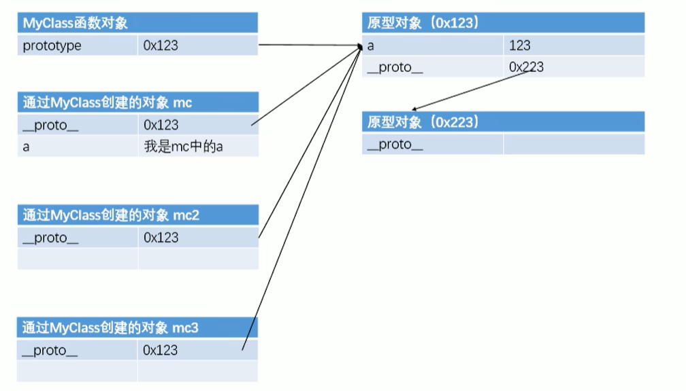

# 

# Math语法

> `Math.sqrt(参数)` ： 对参数开平方

# 弹窗语句

> **`alert("提示信息")`**：弹出一个窗口，显示参数
>
> **`prompt("提示信息")`**：弹出一个带输入框的窗口，提示是参数的值，需要一个变量接收
>
> **`confirm("提示信息")`**：带取消和确定按钮，点击确定返回true,点击取消返回false

# 滚动条事件

> **`元素.onscroll = function(){}`**：为有滚动条的元素在滚动时触发

# 类型

六种数据类型	

| 标识符      | 类型                      |
| ----------- | ------------------------- |
| `String`    | 字符串                    |
| `Number`    | 数值                      |
| `Boolean`   | 布尔                      |
| `Null`      | 空值,Object类型           |
| `Undefined` | 未定义,已声明变量但不赋值 |
| `Object`    | 对象                      |

> Object属于引用数据类型，其他属于基本数据类型

`thpeof 变量` ： 检查变量的类型

```js
const a = 123;
console.log(typeof a);
```

## 特殊返回值	

| 值    | 含义                                                         |
| ----- | ------------------------------------------------------------ |
| `NaN` | Not A Number   不是一个数值。Number类型，任何数和NaN做算数运算都是NaN |
|       |                                                              |
|       |                                                              |

## 强制类型转换

##### *转为字符串*

> **`Number`**转**`String`**	
>
> **`Boolean`**转**`String`**	

`.toString()`	: 	将转换结果返回

```html
const a = 123;
const flag = true;

const b = a.toString();
flag = flag.toString();

console.log( typeof b)
console.log(b)
console.log(typeof flag)
console.log(flag)


-->"String"
-->"123"
-->"String"
-->"true"
```

* [x] Tips：`null`和`undefined`没有`.toString()`方法

* `String(参数)`：将非字符串放入参数，返回一个字符串，可以对`null`和`undefined`使用。

函数底层仍然使用`.toString()`。`null`和`undefined`不会使用`.toString`，而是直接转换

##### *转为数值*

> **`String`** 转 **`Number`**

`Number(参数)`函数	： 将结果返回

```js
const a = "123";

a = Number(a)

console.log(typeof a)

-->"Number"
```

* 如果是纯数字字符串，直接转换为字符串
* 如果字符串中有非数字字符，则返回`NaN`
* 如果是空串或者全空格字符串，转换为0
* true 转为 1
* false 转为 0
* null 转为 0
* undedined 转为 NaN

> **`parseInt()`**和 **`parseFloat()`**	： 	将字符串的有效数值取出来

```js
parseInt("123abc")   		--> "123"
parseInt("123.456abc")		-->"123"
parseFloat("123.456abc")	-->"123.456"
```

* [x] 对于非String类型的值强转为数值，会先转换为String类型，再转换为Number类型

##### *其他类型转Boolean*

**`Boolean()函数`**	

数值类型： 除了 0 和 `NaN` ，其余都是 `true`

字符串类型： 除了空串，其余都是`true`

`null` 和 `undefined`	都是 `false`

对象是`true`

# 运算符

## 算数运算

`+、- 、*、/`： 除了字符串加法是转字符串，其余都是转`Number`

* 对非`Number`类型的值，先转成`Number`再计算
* 任何值和`NaN`运算，都得`NaN`
* 任何值加一个字符串都是先转字符串，再拼接

> 隐式转换: `123 + ""`得到字符123.
>
> `"123"-0`得到数值123

### 一元运算符

> `*`：正号
>
> `-`：负号

任何类型的值被正负号改变之后，都会变成`Number`类型

### 自增运算符

> `++`、`--`
>
> 前加和后加
>
> `a++`的值是`a`的值，计算完之后，`a+1`
>
> `++a`的值是`a+1`的值，计算完之后，`a+1`

```js
var a = 1;
a++;
++a;
```

## 逻辑运算符

> 非布尔值进行 `&&、||`运算

`&&`

* 如果第一个值为`true`，则返回第二个值
* 如果第一个值为`false`，则返回第一个值

`||`

* 如果第一个值为`true`，则返回第一个值
* 如果第一个值为`false`，则返回第二个值

## 关系运算

> `>、<、>=、<=...`

非数值比较时，转成数值

* [x] 任何数和`NaN`做比较，都是`false`

* [x] 当两次都是字符串时，挨个一个一个比Unicode编码

## 条件运算符

> `条件表达式 ? 语句1 : 语句2;`

条件表达式成立，执行语句1，否则执行语句2，返回结果

```js
let a = 10;
let b = 20;
let max = a > b? a : b;
console.log(max)
```

## 优先级

越靠上优先级越高

| 运算符                             | 描述                                         |
| ---------------------------------- | -------------------------------------------- |
| . [] ()                            | 字段访问、数组下标、函数调用以及表达式分组   |
| ++ -- - ~ ! delete new typeof void | 一元运算符、返回数据类型、对象创建、未定义值 |
| * / %                              | 乘法、除法、取模                             |
| + - +                              | 加法、减法、字符串连接                       |
| << >> >>>                          | 移位                                         |
| < <= > >= instanceof               | 小于、小于等于、大于、大于等于、instanceof   |
| == != === !==                      | 等于、不等于、严格相等、非严格相等           |
| &                                  | 按位与                                       |
| ^                                  | 按位异或                                     |
| \|                                 | 按位或                                       |
| &&                                 | 逻辑与                                       |
| \|\|                               | 逻辑或                                       |
| ?:                                 | 条件                                         |
| = oP=                              | 赋值、运算赋值                               |
| ,                                  | 多重求值                                     |

# 代码块

## 条件判断语句

> `if`

语法

```js
if(表达式){
	代码块;
}
```

```js
if(表达式){
    语句块
}else{
    语句块
}
```

```js
if(表达式){
    语句块
}else if(表达式){
    语句块
}else if(表达式){
    语句块
}else{
    语句
}
```

## 条件分支语句

> `switch`

```js
switch(条件表达式){
    case 表达式:
        语句块...
        break;
    case 表达式:
        语句块...
        break;
    case 表达式:
        语句块...
        break;
    default:
        语句...
        break;
}
```

## 循环语句

`break、continue`

break可以终止循环

continue 直接开始下一次判断

> `while`
>
> `do...while`

```js
while(条件表达式){
    语句...
}

do{
    语句...
}while(条件表达式)
```

* `break`：退出循环

> `for`

```js
for(初始化表达式;条件表达式;更新表达式){
    
    语句..
    
}
```

# 对象

> **创建对象**
>
> `let obj = new Object();`

* **向对象添加属性**

```js
obj.name= 'name'
obj.gender = '男'
```

* **读取对象的属性值**

```js
alert(obj.name)
```

* **删除对象的某个属性**

```js
delete obj.name
```

* **特殊属性名的赋值方式**

```js
obj['111'] = 123;
console.log(obj['111'])
```

* **`obj[]`中可以放变量**

```js
let n = 'name'
console.log(obj[n])
可以访问name的值
```

* **可以把对象当做另一个对象的属性**

```js
let obj2 = new Object();
obj.child = obj2;
```

* **查看一个对象中是否有某个属性**

```js
//检查obj中是否含有name,返回boolean
console.log("name" in obj)
```

## 对象字面量

> **`let obj = {}`**
>
> **`let obj = {name:',age:'}`**

```js
let obj = {
    	name:'zhangsan',
    	age:28,
    	gender:'nan'
}
```

## 对象工厂

> 使用一个函数封装对象的创建过程

```js
function createPerson(name,age,address){
            let obj = new Object();
            obj.name = name;
            obj.age = age;
            obj.address = address;
            obj.printName = function(){
                alert(this.name);
            }
            return obj;
        }

let person1 = createPerson('zs',19,'bzd');
let person2 = createPerson('ls',19,'bzd');
let person3 = createPerson('ww',19,'bzd');
console.log(person1);
console.log(person2);
console.log(person3);
person3.printName;
```

## 构造函数

> 构造函数和普通函数没有区别，只有函数名第一个字母大写
>
> 对函数调用时在前面加入`new`就是创建构造对象
>
> 构造函数里的this就是new构造函数的对象

```js
function fun(){
    alert(this.name);
}
function Person(name,age){
    this.name = name;
    this.age = age;
    this.sayName = fun;
}
let p1 = new Person('zs',18);
let p2 = new Person('ls',18);
alert(p1.sayName);
```

# 函数

> **`function 函数名(形参){}`**
>
> 或
>
> **`var 函数名 = function(形参){}`**

```js
function fun(){
    alert("hello");
}

let fun2 = function(){
    alert("hello");
}
```

调用函数

> **`函数名()`**

```js
fun();
```


函数返回值

> **`return`** 来返回函数的值

```js
function sum(a,b){
    return a+b;
}
let result = sum(1+2);
```


> 实参可以是对象和任何类型
>
> 如果实参是一个函数，

```js
fun(fun1)	： 把函数体传过去，不调用
fun(fun1())	： 把函数的返回值传过去，已经调用过，传递的是`fun1`函数的返回值
```


> **`return`**	可以返回任意类型，也可以是对象和函数体


> 立即执行函数	
>
> 匿名，只能执行一次

```js
(function(){
    ...
})(参数);
```


> 函数也可以作为对象的一个属性，叫做对象的方法

### **`fun.call(obj,v1,v2..) / fun.apply(obj,[v1,v2..])`**

> 函数调用时，默认的`this`指的是`window`,用这两个方法可以把`this`变为`obj`对象	
>
> `obj`参数不算传递实参，其后的参数才是传参，但是`.apply()`必须是一个数组

# 对象的枚举

> **`for ... in`**
>
> 把对象的属性挨个赋值给一个变量然后输出
>
> 可以用变量获取对象的某个属性的值，但是只能这么写**`person[变量]`**

```js
let person = {
    name:'',
    age:'',
    address:''
}

for(let i in person){
    console.log(i);
    console.log(person[i]);
}
```

# 作用域

**`全局作用域`**

**`window`**

> 全局作用域：`写在script标签中的变量，打开页面变量创建，关闭时销毁`
>
> 全局对象`window`:由浏览器创建,创建的全局变量都会变成window对象的属性，创建的函数都会变成window对象的方法


**`函数作用域`**

> :point_right: 函数被调用时创建函数作用域，函数执行完毕时销毁
>
> :point_right: 每被调用一次，就会创建一个函数作用域，互相独立
>
> :point_right: 在函数中可以访问全局变量
>
> :point_right: 全局作用域中无法访问到函数作用域变量
>
> :point_right: 在函数里想跨越函数变量防卫全局变量时:`window.变量`


# 变量的提前声明

> 使用`var`声明的变量会在最开始创建
>
> 使用`function fun(){}`方式声明的函数提前创建
>
> 但是使用`var`声明的函数不会提前创建


# this

> 根据函数的调用方式不同，this会指向不同的对象

:one:: 以函数的形式调用，`this`指向`window`

:two::以一个对象的方法调用时，指向调用的对象

:three::以构造函数的形式调用，指的是构造函数创建的对象

:four::使用`.call()/.apply()`调用时，指向指定的对象

```js
let name = 'quanju';
        function fun1(){
            alert(this.name);
        }
let person = {
            name:'zs',
            age:18,
            address:'www',
            fun:function(){
                alert(this.name);
            			}
			}
        
person.fun(): /指向对象中的name
fun1();/指向全局的name
```

# 原型

> **`prototype`**
>
> 创建的每一个函数，都会被解析器想函数中添加一个属性`prototype`,叫做原型对象
>
> `函数名.prototype`：指向原型对象
>
> 普通函数调用没有作用，以`构造函数`的方式调用时，对象也有一个属性，指向原型对象
>
> `mc.__proto__`:是对象访问原型对象
>
> :point_right::向原型对象中添加属性:`MyClass.prototype.属性名=值`
>
> :yellow_heart::原型对象相当于一个公共的区域，所有同一个类创建的实例都可以访问该类的原型对象,`可    	以把对象中共有的内容，统一设置到原型对象中`
>
> :yellow_heart::访问对象的属性时，先在对象中找，找不到再去原型对象中找,所以`全局的函数最好放在一个类的原型对象中，防止污染全局作用域`
>
> :yellow_heart::原型对象也是对象，也有原型对象,`mc.__proto__.__proto__`是访问原型对象的原型，再原型就是`Object`，再往后就没有原型了



```js
function Person(name,age){
            this.name = name;
            this.age = age;
        }
Person.prototype.sayName = function(){
    alert(this.name+value);
}
let p1 = new Person('zs',18);
let p2 = new Person('ls',18);
p1.sayName();
```

> `对象.hasOwnProperty("属性")`:查看某个属性是否在自己对象里，不管原型里有没有
>
> `"属性 in 对象"`:查看某个属性是否在自己对象里，或者原型对象里

# 垃圾回收

> 只需要把不需要的对象的值设置为null,JS自动回收

```js
let obj = new Person();
obj = null;
```

# 数组

> `Array`:也是一个对象
>
> 索引从`0`开始
>
> 创建数组：`let arr = new Array(1,2,3..);`			`let arr = [1,2,3,4,5,6..];`
>
> 特殊的:`let arr = new Array(10)`:创建长度为10的数组,没有值
>
> ​				 `let arr = [10]`:创建长度为1的数组，值为10
>
> 数组可以放任意类型，包括对象

```js
let arr = new Array();/创建数组对象
arr[0] = 1;
arr[1] = 2;
console.log(arr[0]);/下标越界返回undefined
```

> 数组对象的方法

:arrow_forward::`length`:设置或返回数组的长度

​							向数组的最后添加数据：`arr[arr.length] = 值`

:arrow_forward::`concat()`:连接多个数组,`arr.concat(arr2)`,返回一个数组，不会对原数组有影响

:arrow_forward::`push()`：向数组末尾添加一个或多个元素，返回值是长度

:arrow_forward::`pop()`：删除并返回数组的最后一个元素

:arrow_forward: `unshift()`：向数组的开头添加一个或多个元素，返回值是长度

:arrow_forward::`shift()`:删除数组的第一个元素，并返回

:arrow_forward::`reverse()`:颠倒数组中元素的顺序，会影响原数组

:arrow_forward::`sort()`：对数组进行排序

:arrow_forward::`join('')`:把数组转换为字符串,参数是指定拼接的字符

## 数组遍历

> **`forEach`**
>
> 数组有几个元素，就遍历几次，每次把对应的元素传过去
>
> 函数可以接收三个参数
>
> 1.传输的对应的每个元素
>
> 2.对应元素的索引下标值
>
> 3.数组本身

```js
let arr = [1,2,3]
arr.forEach(function(value,index,arr){
    console.log(value)
})
```

## slice()

> 从已有数组中返回指定元素，包含开始，不包含结束
>
> 不会影响原数组

**`arr.slice(start,end)`**

| 参数    | 意义                                           |
| ------- | ---------------------------------------------- |
| `start` | 指定从何处开始截取                             |
| `end`   | 可选，到哪里结束(不包括)，不写到最后，负数往前 |

```js
let arr = [1,2,3,4,5];

let result = arr.slice(0,3);

console.log(arr);
console.log(result);
```

## splice()

> 删除元素，然后向数组添加新元素，返回删除的元素
>
> 会影响原数组

**`arr.splice(start,value2,value3)`**

| 参数     | 意义                           |
| -------- | ------------------------------ |
| `start`  | 指定从何处开始                 |
| `value2` | 指定删除几个                   |
| `value3` | 这个参数的值会插入到删除的位置 |

```js
let arr = [1,2,3,4,5];

let value = arr.splice(1,1,"值1","值2");

console.log(arr);
```

# `arguments`

> 调用函数时传输的实参都会保存在`arguments`中，是隐含的传递参数
>
> 一个类数组对象，可以获取长度
>
> `arguments.cellee`:返回当前指向的函数对象

```js
function fun(){
    console.log(arguments.length);/2
    console.log(arguments[0]);/1
    console.log(arguments[1]);/2
}   
fun(1,2);

-->2
-->1
-->2
```

# Date对象

**`let date = new Date()`**

> 返回当前时间

`let date = new Date("10/1/2008 11:30:30")`

> 指定返回时间,2008.10.1  11:30:30
>
> 月/日/年 时:分:秒

| 方法          | 描述                                         |
| ------------- | -------------------------------------------- |
| `getDate()`   | 返回Date对象中一个月的某一天1~31             |
| `getDay()`    | 返回一周的某一天0~6                          |
| `getMonth()`  | 返回对象中的月份                             |
| `getFullYear` | 返回四位数年份                               |
| `Date.now()`  | 获取当前代码执行时的时间戳，用于测试代码性能 |

# Math

> 一个工具类，不用创建对象，封装的是数学运算相关的属性和方法

属性

| 代码    | 意义                  |
| ------- | --------------------- |
| Math.PI | 返回PI,≈3.14159       |
| LN2     | 返回以2为底的自然对数 |
|         |                       |
|         |                       |

方法

> Math.方法

| 方法       | 描述                       |
| ---------- | -------------------------- |
| `abs(x)`   | 返回数的绝对值             |
| `ceil(x)`  | 对值进行向上舍入，向上取整 |
| `floor(x)` | 向下取整                   |
| `round(x)` | 四舍五入                   |
| `max(x,y)` | 返回最大值                 |
| `min(x,y)` | 返回最小值                 |
| `random()` | 返回0~1之间的随机数        |
| `pow(x,y)` | 返回x的y次幂               |

> `random`

生成X-Y的随机数

```js
Math.round(Math.random()*(Y-X))+Y
```


# 包装类

> `String()`:把基本数据类型转换为String对象
>
> `Number()`:把基本数据类型转换为Number对象
>
> `Boolean()`:把基本数据类型转换为Boolean对象
>
> 浏览器自己使用，自己不能使用这些
>
> 用处是可以让基础数据类型使用对象的方法，如String的`toString()`方法

```js
let num = new Number(1);
let str = new String("1");
let boo = new Boolean(true);
```

## 字符串的方法

字符串底层是把每一个字符存在数组中

```js
let str = "Hello"
```


| 方法                    | 描述                                                         |
| ----------------------- | ------------------------------------------------------------ |
| `str.length()`          | 获取字符串长度，和数组一样                                   |
| `str[1]`                | 可以使用下标索引                                             |
| `charAt()`              | 返回指定位置的字符                                           |
| `charCodeAt()`          | 返回指定位置字符的Unicode编码                                |
| `String.formCHarCode()` | 根据参数Unicode编码获取一个字符                              |
| `concat()`              | 连接字符串                                                   |
| `indexof()`             | 查看字符串中是否含有参数指定的字符，有则返回索引，无则返回-1 |
|                         | 可以有第二个参数，就是从第几个索引开始查询，默认是0          |
| `lastIndexOf()`         | 从后往前找                                                   |
| `substring`             | 和`slice()`效果一样                                          |
| `split()`               | 把一个字符串根据参数指定的字符拆开成数组                     |
| `toUpperCase()`         | 把字符串变成大写                                             |
| `toLowerCase()`         | 把字符串变成小写                                             |
| `search()`              | 搜索字符串中是否含有指定内容                                 |
| `replace("a","b")`      | 将字符串中指定内容替换为新的内容                             |
|                         | 参数1：被替换的内容，参数2：新的内容,可以用正则表达式        |
|                         | `str.replace(/a/gi,"b")`吧所有的`a`换成`b`                   |

> `split()`参数可以传递正则表达式，以正则表达式去拆分,默认就是全局匹配

```js
let str = "1a2d4g6h7j5g"
let result = str.split(/[A-z]/);//以所有字母来拆分
```

> `search("")`,搜索到指定内容就返回第一次出现的索引位置，没有返回-1，可以传递正则表达式
>
> 不能全局匹配，只扫描第一个

```js
let str = "hello abc aec adc";
let result = str.search(/a[bed]c/);//查找abc  aec  adc
```

> `match()`：可以根据正则表达式，从一个字符串中将符合条件的内容提取出来，返回值是`数组`

```js
let str = "1kjh21kj3hkj12";
let result = str.match(/[A-z]/g);//可以提取所有的字母，默认只会执行一次，g可以执行全部
```


# 正则

> 正则表达式使用时需要创建对象
>
> :one:**`let reg = new RegExp("正则表达式","匹配模式")`**
>
> :two:**`let reg = /正则表达式/匹配模式`**
>
> ```js
> let reg = /[]/gi;//即是忽略大小写，又是全局匹配
> ```
>
> 匹配模式有两种:
>
> `i`：忽略大小写
>
> `g`：全局匹配模式，不会在匹配第一个完成时停止，会查找所有

 :grey_exclamation: 构造函数创建的方式更加灵活

测试的方法

>  **`test()`**

使用这个方法可以检查一个字符串是否符合正则表达式规定的规则，符合返回`true`，不符合则返回`false`

```js
let reg = new RegExp("a");

let str = 'a';

reg.test(str);
```


## 正则规则

[正则表达式语法网址](https://www.runoob.com/regexp/regexp-syntax.html    )

括号

| 代码            | 描述                                              |
| --------------- | ------------------------------------------------- |
| `/字符/ `       | 测试是否包含指定字符，匹配模式为`i`则不区分大小写 |
| `/a | b | .../` | 字符串中有`a`或者`b`，有一个就可以                |
| `/[ab..]/`      | 也是或的关系，有一个就行，等于上一行              |
| `/[a-z]/`       | 任意小写的英文字符                                |
| `/[A-Z]/`       | 任意大写英文字母                                  |
| `/[A-z]/`       | 任意英文字符                                      |
| `/a[bcd]e/`     | `a`开头，`e`结尾，中间时`bcd`之一                 |
| `/[^ab]/`       | 是否包含除了`a`或`b`以外的字符                    |
| `/0-9/`         | 任意数字                                          |

量词

| 代码        | 描述                                                      |
| ----------- | --------------------------------------------------------- |
| `/a{n}/`    | `a`出现`n`次,`{n}`只对前面一个字符有用                    |
| `/(ab){n}/` | `ab`出现`n`次                                             |
| `/a{m,n}/`  | `a`出现`m~n`次,后者不写就是`m`次以上                      |
| `/ab+c/`    | `b`至少出现一次                                           |
| `/ab*c/`    | `b`出现至少0次                                            |
| `/ab?c/`    | `b`出现0次或1次                                           |
| `/^a/`      | `^`表示字符串开始位置，意思是`a`紧跟在开头，也就是`a`开头 |
| `/a$/`      | `a`后就是结尾，`a`后不能有字符                            |
| `/^...$/`   | 要求必须完全符合正则表达式中的值                          |

特殊

| 代码   | 描述                                            |
| ------ | ----------------------------------------------- |
| `/./`  | 表示任意字符                                    |
| `/\./` | `\`是转义字符                                   |
| `/\w/` | 表示任意`字母、数字、下划线 `>`[A-z0-9_]`       |
| `/\W/` | 除了`字母、数字、下划线`>`[^A-z0-9_]`           |
| `/\d/` | 表示任意`数字`>`[0-9]`                          |
| `/\D/` | 除了`数字`>`[^0-9]`                             |
| `/\s/` | 表示空格                                        |
| `/\S/` | 表示除了空格                                    |
| `/\b/` | 单词边界，判断是否是一个独立的单词>`[\b单词\b]` |
| `/\B/` | 除了单词边界                                    |


## 一些正则表达式

| 解决环境         | 表达式                                                 |
| ---------------- | ------------------------------------------------------ |
| 判断是否是手机号 | `/^1[3-9][0-9]{9}$/`                                   |
| 去除两侧空格     | `str.replace(/^\s*|\s*$/g,"")`                         |
| 判断邮箱规则     | `/^[a-zA-Z0-9_-]+@[a-zA-Z0-9_-]+(\.[a-zA-Z0-9_-]+)+$/` |


# DOM

> `Document Object Model`

|          | nodeName    | nodeType | nodeValue |
| -------- | ----------- | -------- | --------- |
| 文档节点 | `#document` | 9        | null      |
| 元素节点 | 标签名      | 1        | null      |
| 属性节点 | 属性名      | 2        | 属性值    |
| 文本节点 | `#text`     | 3        | 文本内容  |

## document

> 通过`id`获取对象
>
> **`document.getElementById("")`**

```js
document.getElementById("btn");
```

获取对象之后可以使用该对象的事件

> 如:`onclick`

```js
let btn = document.getElementById("btn");

btn.onclick = function(){
    alert("...");
}
```

> `onload`：在页面DOM加载完之后再执行

```js
window.onload = function(){
    alert("...");
}
```

`innerHtml`：获取元素内部的HTML代码，对于自结束标签没有意义

`innerText`：获取元素内部的文本内容

## 获取元素节点

* 通过`document`对象调用，返回一个类数组对象

|                          |                                    |
| ------------------------ | ---------------------------------- |
| `getElementById()`       | 通过id来获取一个元素节点对象       |
| `getElementsByTagName()` | 通过标签名获取一组节点对象         |
| `getElementsByName()`    | 通过name属性来获取一组元素节点对象 |

* 读取元素属性

```js
let btn = document.getElementById("btn");
//读取元素内部htlm的代码
btn.innerHTML
//读取id的值
btn.id
//读取name的值
btn.name
//读取value的值
btn.value
//读取class的值
btn.className
```

## 获取元素节点的子节点

|                          |                                                            |
| ------------------------ | ---------------------------------------------------------- |
| `getElementsByTagName()` | 返回当前节点的指定标签名的后代节点                         |
| `childNodes`             | 表示当前节点的所有子节点，会把标签之间的空白也当做一个节点 |
| `children`               | 获取当前元素的所有子元素，不会包括空白文本                 |
| `firstChild`             | 表示当前节点的第一个子节点，包括空白                       |
| `firstElementChild`      | 获取当前节点的第一个子元素，不包括空白                     |
| `lastChild`              | 表示当前节点的最后一个子节点，包括可空白                   |

```js
let ul = document.getElementById("ul");

//查找所有ul的后代li节点
let lis = ul.getElementsByTagName("li");
```

## 获取父节点和兄弟节点

|                   |                          |
| ----------------- | ------------------------ |
| `parentNode`      | 获取当前节点的父节点     |
| `previoutSibling` | 当前节点的前一个兄弟节点 |
| `nextSibling`     | 当前节点的后一个兄弟节点 |

## 获取body元素

> document有一个body属性，可以直接获取到body元素

```js
let body = document.body;
```

## 获取html元素

```js
let html = document.documentElement;
```

## 获取页面里的所有元素

> 包括meta 标签，html标签,script标签等

```js
let all = document.all;
let all1 = document.getElementByTagName("*");
```

## 根据class属性查询元素

> `getElementsByClassName()`

```html
<scrip>
	let box = document.getElementsByClassName("box1");
</scrip>

<div class = "box1">
    
</div>
```

## 根据CSS选择器来查询元素节点

> `document.querySelector()`
>
> 缺点是只会返回第一个，尽管有多个
>
> `document.querySelectorAll()`
>
> 也可以用css来选择节点，并且会返回所有选中的节点，返回一个数组

```html
<script>
	let box1 = document.querySelector(".box1")
</script>

<div class="box1">
	<div>
        
    </div>
</div>
```

# DOM的增删改

| 方法               | 描述                                                         |
| ------------------ | ------------------------------------------------------------ |
| `appendChild()`    | 添加子节点到指定节点                                         |
| `removeChild()`    | 删除子节点，`父节点.removeChild(子元素)`                     |
| `replaceChild()`   | 替换子节点，`父节点.replaceChild(新节点,旧节点)`             |
| `insertBefore()`   | 在指定节点前插入新节点,`父节点.insertBefore(新节点,指定节点)` |
| `createElement()`  | 创建元素节点,参数就是标签名，如"li"                          |
| `createTextNode()` | 创建文本节点,参数就是文本值                                  |
| `getAttribute()`   | 返回指定属性值                                               |
| `setAttribute()`   | 设置指定属性值                                               |

> 创建一个节点，并添加到指定节点下

```html
<script>
	let li = document.createElement("li");//创建一个li元素标签
    let text = document.createTextNode("中国");//创建一个文本节点
    li.appendChild(text);//使用父元素的appendChild方法可以把节点添加在后代
    let ul = document.getElementById("city");
    ul.appendChild(li);
</script>


<ul id="city">
    <li>邯郸</li>
    <li>石家庄</li>
    <li>河北</li>
</ul>
```


# 操作CSS样式

> 通过JS修改元素的样式,修改的是内联样式，读取的也是内联样式，没有内联就返回空
>
> **`元素.style.样式名 = 值`**：设置样式
>
> **`元素.style.样式名`**：读取样式

```js
let box1 = document.getElementById("box1")

box1.style.width = "300px"
box1.style.height = "300px"
```

修改的样式如`background-color`的`-`是不合法的，需要把`-`之后的字母大写，使用驼峰命名法

`backgroundColor`		`borderTopWidth`

> 读取和设置当前有效果的样式，不管是外部还是内联
>
> **`元素.currentStyle.样式名`**
>
> :star:：该方法只有IE支持，其他都不行

> **`window.getComputedStyle(参数1,参数2)`**：可以获取生效的CSS样式值，支持其他浏览器
>
> 参数1：要获取样式的元素
>
> 参数2：传递一个伪类，一般传`null`
>
> 返回一个对象，对象中封封装了当前元素对应的样式

```js
let box1 = document.getElementById("box1");

alert(getComputedStyle(box1).width);
```

:star2:上述两个方法都是只能读，不能该44

> **`clientWidth/clientHeight`**
>
> 获取元素的可见宽度和高度，包括内边距所占用的大小，不包括外边距
>
> 不能修改

> **`offsetWidth/offsetHeight`**
>
> 获取元素的宽度和高度，包括了内边距和外边距和边框，也就是元素全部占用的大小
>
> 不能修改

> **`offsetLeft`	**：返回当前元素对其父元素的水平偏移量
>
> **`offsetTOp`**	： 返回当前元素对其父元素的垂直偏移量

> **`scrollWidth`**	：获取元素内滚动区域整体的宽度
>
> **`scrollHeight`**：获取元素内滚动区域整体的高度

> **`scrollLeft`**:获取水平滚动条滚动的距离
>
> **`scrollTop`**:获取垂直滚动条滚动的距离

:ticket:：当满足以下条件时

:point_right: **`元素.scrollHeight - 元素.scrollTop = 元素.clientHeight`**

证明滚动条滚动到了最下面

:point_right: **`元素.scrollWidth - 元素.scrollLeft = 元素.clientWidth`**

证明滚动条滚动到了最右面


# 鼠标与键盘事件event

**`每次事件函数被触发时，浏览器都会传递一个参数，参数中封装了当前事件的所有信息，包括：鼠标的坐标，键盘按下的键，滚轮的方向，事件对象是event`**

> `onmousemove`：鼠标在元素中移动时触发
>
> `onmousedown`：当鼠标被按下时触发
>
> `onmouseup`：当鼠标按下松开时触发
>
> `onmousewheel`：当鼠标在元素中滚轮滚动时触发

```js
let app = document.getElementById("app");

app.onmousemove = function (event) {
    console.log(event);
}
```

`clientX`：获取鼠标的水平坐标，总是以当前可视窗口为依据，不会因为滚动而改变

`clientY`：获取鼠标的垂直坐标，也是。

`pageX`：也是获取鼠标的X轴坐标，不同的是，这个以页面为参考物，不是以可视窗口

`pageY`：同上，获取Y轴

`event = event || window.event`	：解决浏览器兼容问题

==如果想让元素跟随鼠标移动，那么元素必须开启定位，建议开启绝对定位==

`event.wheelDelta`：可以获取鼠标滚轮滚动的方向		`正数向上滚，负数向下滚`		

## **键盘事件**

> `onkeydown`：键盘按键被按下
>
> `onkeyup`：键盘按键松开

* 键盘事件一般给能够获取焦点的元素上
* 如果按下键不松手就会连续一直触发按下方法，松开方法只触发一次
* 通过`keyCode`来获取按键的编码，来判断是哪个按键被按下了 

```js
event.keyCode === 某个按键的编码
```

* 使用一下几个属性来判断特定的按键是不是按下了 

```js
event.altKey	//alt是否按下
event.ctrlKey	//ctrl是否按下
event.shiftKey	//shift是否按下
```


## 事件的冒泡

> 指的是，事件向上传递，`当后代元素的事件触发时，其祖先元素的相同事件也会被触发`

取消冒泡：`event.cancelBubble = true`

## 事件的委派

> 把多个元素的相同事件绑定给祖先元素，这样所有后代都可以触发这个事件方法，只绑定一次，不需要查询所有的元素，即使是后添加的元素也可以使用方法

为了给指定的后代元素触发事件，`event`中有一个方法，可以返回是哪个元素触发了方法

`event.target`：返回触发方法的元素

```html
ul.onclick = function(event){
    if(event.target.className="link"){
     	alert("");
    }
}


<ul>
	<li><a class="link"></a></li>	    
  	<li><a class="link"></a></li>	    
   	<li><a class="link"></a></li>	    
</ul>
```

## 为同一个对象绑定多个方法

> `obj.addEventListener(事件名,方法)`
>
> 如:`obj.addEventListener("click",function(){})`
>
> 可以多次使用，对同一个对象绑定多个方法，依次触发


## 练习：拖拽

```js
let app = document.getElementById("app");
app.onmousedown = function () {
    let xCha = event.clientX - app.offsetLeft;
    let yCha = event.clientY - app.offsetTop;
    document.onmousemove = function (event) {
        let left = event.clientX - xCha;
        let top = event.clientY - yCha;
        app.style.left = left+"px";
        app.style.top = top +"px";
    };
    document.onmouseup = function () {
        document.onmousemove = null;
        document.onmouseup = null;
    }
}
```


# BOM

==浏览器对象模型，可以通过js来操作浏览器==

| 对象        | 描述                                                   |
| ----------- | ------------------------------------------------------ |
| `Window`    | 表示浏览器窗口，网页中的全局对象                       |
| `Navigator` | 浏览器信息，用于识别不同的浏览器                       |
| `Location`  | 表示浏览器地址栏信息，可以获取和设置跳转               |
| `History`   | 表示浏览器的历史记录，只能前进和后退，无法获取具体网页 |
| `Screen`    | 表示屏幕，获取显示器的信息，用于适配各种显示器         |

> **`Navigator`**

|                       |                                       |
| --------------------- | ------------------------------------- |
| `navigator.appName`   | 返回浏览器名称,大部分都是网景，没啥用 |
| `navigator.userAgent` | 常用的返回浏览器信息方法              |
|                       |                                       |
|                       |                                       |

使用`.userAgent`判断是什么浏览器，依然无法获取IE11

```js
(function () {
    let llq = navigator.userAgent;
    if(/firefox/i.test(llq)){
        console.log("你使用的是火狐浏览器");
    }else if(/chrome/i.test(llq)){
        console.log("你是用的是Chrome浏览器");
    }else if(/msie/i.test(llq)){
        console.log("你是用的是IE浏览器")
    }
})();
```

> **`History`**

可以操作浏览器向前或向后翻页

`history.length`：可以获取当次打开链接的链接数量

`history.back()`	：用于返回上一个页面

`history.forward()`：可以前往下一个页面

`history.go()`：用于跳转到指定页面，参数是`正数`就向前跳，`1`就是跳一个，`2`就是向前跳2个页面，负数就是向后跳，同上。


> **`Location`**

直接获取则返回浏览器路径的地址

也可以设置地址，那么就会跳转页面

`location.reload()`：相当于刷新按钮，如果传递参数`true`则会强制刷新，清空缓存

`location.replace()`：相当于跳转按钮，但是是替换当前页面，不会生成历史记录，不能后退


# 定时器

> **`setInterval()`**：定时调用，可以将一个函数每隔一段时间执行一次

有两个参数

1、回调函数，每隔一段时间就会执行一次该函数

2、规定间隔的时间，单位是毫秒

`setInterval(function(){},1000);`

关闭定时器：`clearInterval(标识)`

`setInterval()`有一个返回值，可以通过返回值来关闭定时器

```js
let timer1 = setInterval(function(){},1000);

clearInterval(timer1);
```


> **`setTimeout(function(){},1000)`**

延时一段时间后执行

延时`1000毫秒`之后执行函数`function`

只执行一次

`clearTimeout(标识)`：可以关闭延时定时器


# Class修改

> `元素.className = ""`：可以修改元素绑定的class值

可以通过修改class值来修改元素的外观,让元素的`class`值修改

```html
<style>
    .box1{
        width: 100px;
        height:100px;
    }
    .box2{
        width: 300px;
        heightL300px;
    }
</style>


<script>
    let box1 = document.getElementById("box1");
    box1.className="box2";
</script>

<body>
    <div class="box1">
        
    </div>
</body>
```

如果想要在`class`的值中添加一个css属性，而不是覆盖，则可以使用`+=`

一定要加上空格，而且需要检查是否已经有了想添加的css，使用正则

```js
box1.className += " "+想要添加的css选择器 
```


# JSON

用于数据的交互

==JSON和JS对象格式一样，只不过JSON字符串中的属性名必须加引号，其他和JS语法一致==

>  JSON分类：

`1.对象{}`

```js
let obj = '{"name":"zs","age":18,"loca":"hebei"}'
```

`2.数组[]`

```js
let obj = '[1,2,3,4,"hello"]'
```


>  JSON中允许的值：

`字符串、数值、布尔值、null、对象、数组`

不能是函数

## JSON和JS的互相转换

`JSON.parse(json对象)`：需要一个`JSON字符串`作为参数，转换为JS对象

`JSON.stringify(js对象)`：需要一个`JS对象`作为参数，转换为JSON字符串
