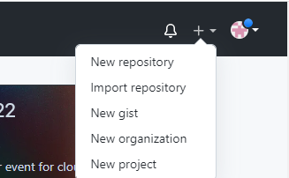
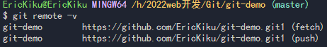
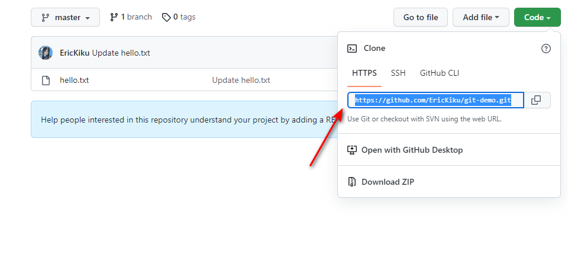
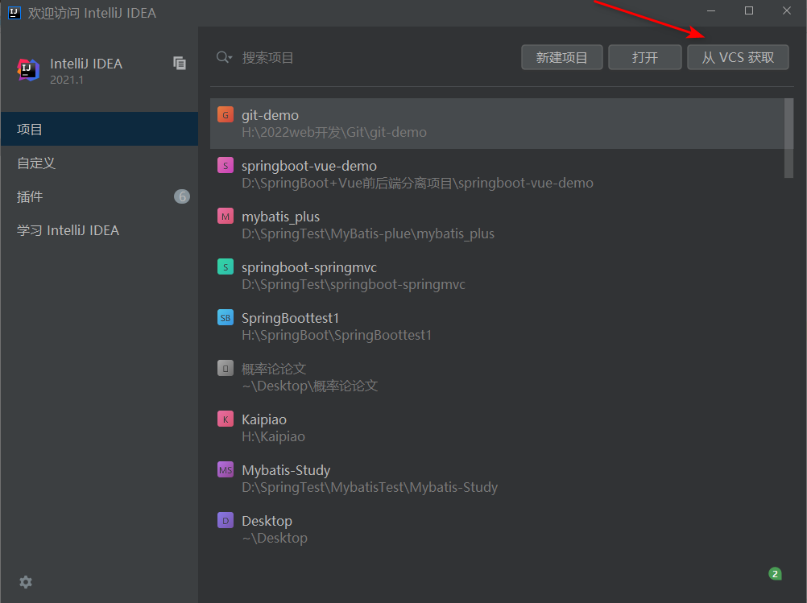

# 


Git 是一个开源的`分布式版本控制系统`，用于敏捷高效地处理任何或小或大的项目。

Git 是 Linus Torvalds 为了帮助管理 Linux 内核开发而开发的一个开放源码的版本控制软件。

Git 与常用的版本控制工具 CVS, Subversion 等不同，它采用了分布式版本库的方式，不必服务器端软件支持。

Git[易于学习](https://git-scm.com/doc)， [占用空间小，性能快如闪电](https://git-scm.com/about/small-and-fast)。它优于 SCM 工具，如 Subversion、CVS、Perforce 和 ClearCase，具有[廉价的本地分支](https://git-scm.com/about/branching-and-merging)、方便[的暂存区域](https://git-scm.com/about/staging-area)和 [多个工作流](https://git-scm.com/about/distributed)等功能。

# 安装

直接官网：https://git-scm.com/

点小屏幕下载安装，一直默认就ok，要不就看网上配置

在VsCode中使用GitBash的方法：https://www.cnblogs.com/qdlhj/p/14577638.html


# Git常用命令

| 命令                              | 作用           |
| --------------------------------- | -------------- |
| `git config --global user.name`   | 设置用户签名   |
| `git config --global user.email`  | 设置用户签名   |
| `git init`                        | 初始化本地库   |
| `git status`                      | 查看本地库状态 |
| `git add 文件名`                  | 添加到暂存区   |
| `git commit -m "日志信息" 文件名` | 添加到本地库   |
| `git reflog`                      | 查看历史记录   |
| `git reset --hard 版本号`         | 版本穿梭       |

## 初始化本地库

```
git init
```

在想要使用Git管理的目录下，打开`Git Bash Here`界面初始化

初始化之后，会生成一个`.git`隐藏文件

## 查看库状态

```
git status
```

第一次查看会出现以下的结果：

```
On branch master	：在master分支上

No commits yet		：当前没有提交过文件
//没有需要提交的文件
nothing to commit (create/copy files and use "git add" to track)	

```

## 暂存区

当有新的文件时，`git status`就返回下面的状态

意思是有新的文件没有被追踪，需要使用`git add 文件名`

```
On branch master

No commits yet

Untracked files:
  (use "git add <file>..." to include in what will be committed)
        hello.txt		//文件名显示红色

```


需要使用`git add 文件名`，把文件添加到暂存区，此时再次查看`git status`，会显示以下结果：

```
On branch master

No commits yet

Changes to be committed:
  (use "git rm --cached <file>..." to unstage)
        new file:   hello.txt	//文件名显示绿色
```

意思是已经追踪到该文件，可以通过`git rm --cached 文件名` 删除暂存区的文件，本地的不会删除


## 本地库

### 将暂存区的文件提交到本地库

```
git commit -m "日志信息" 文件名
```

再次查看`git status`时：

没有了第二句话，说明已经提交过文件

最后一句话是说明没有需要提交的文件了

```
On branch master
nothing to commit, working tree clean
```

### 查看日志

```
git reflog
```

结果：每次修改斗湖有一个版本号，HEAD指针会指向当前的版本

```
c3c851e (HEAD -> master) HEAD@{0}: commit: second commit
0f8c7c7 HEAD@{1}: commit (initial): first commit
```


## 修改文件

当修改了文件之后，查看库状态会显示：

```
On branch master

Changes not staged for commit:
  (use "git add <file>..." to update what will be committed)
  (use "git restore <file>..." to discard changes in working directory)
        modified:   hello.txt	//显示红色

no changes added to commit (use "git add" and/or "git commit -a")
```


需要再次把文件添加到暂存区，再提交到本地库

就增加了一个版本


## 历史版本

### 查看历史版本

```
git reflog		查看版本信息
```

```
git log			查看版本详细信息
```


### 版本穿梭

```
git reset --hard 版本号
```


# 分支

几乎每一种版本控制系统都以某种形式支持分支，一个分支代表一条独立的开发线。

使用分支意味着你可以从开发主线上分离开来，然后在不影响主线的同时继续工作。

分支的操作：

| 命令                   | 作用                         |
| ---------------------- | ---------------------------- |
| `git branch 分支名`    | 创建分支                     |
| `git branch -v`        | 查看分支                     |
| `git checkout 分支名`  | 切换分支                     |
| `git merge 分支名`     | 把指定的分支合并到当前分支上 |
| `git branch -d 分支名` | 删除分支                     |

先创建分支，在切换分支，操作之后，再把分支合并到主分支上


## 合并冲突

当同时有两个分支修改一个文件，并且把一个分支合并到另一个分支的时候，会发生合并冲突，接下来我们需要手动去修改它。把冲突的代码人为修改。

最后使用`git add 文件名`把文件添加追踪后提交到本地库


# Git团队协作机制

## GitHub

### 创建一个远程库



点击加号，点击`New repository`


## 远程仓库操作

| 命令名称                             | 作用                                                       |
| ------------------------------------ | ---------------------------------------------------------- |
| `git remote -v`                      | 查看当前所有远程地址别名                                   |
| `git remote add 别名 远程地址`       | 起别名                                                     |
| `git push 别名 分支`                 | 推送本地分支上的内容到远程仓库                             |
| `git clone 地址`                     | 将远程仓库的内容克隆到本地                                 |
| `git pull 远程库地址别名 远程分支名` | 将远程库中对于分支的最新内容拉下来后与当前本地分支直接合并 |


1. #### 创建别名

```
git remote add git-demo https://github.com/EricKiku/git-demo.git
```

2. #### 查看别名

```
git remove -v
```



3. #### 把本地库的分支推送到远程库中

```
git push git-demo master
```

4. #### 把远程库代码拉取到本地库

```
git pull git-demo master
```

5. #### 克隆

克隆就是本地库没有对应的git库，是直接把别人的项目克隆下来

克隆代码不需要登录账号，克隆完会自动`拉取代码-初始化本地库-创建别名`

```
git clone 地址
```

克隆需要的地址在这个地方：




但是推送时，会显示没有权限。需要在远程库的`Settings-Collaborators`来邀请人，

被邀请的人需要在自己的GitHub页面打开输入邀请地址，同意邀请后

这个人才可以推送他的本地库


## SSH免密登录

1. 需要一个`.ssh`公钥

在`git-bash`窗口中

```
ssh-keygen -t rsa -C 描述(邮箱)
```

在用户目录下有一个`.ssh`文件夹，其中`.pub`是公钥，另一个是私钥

把公钥生成的代码全部复制

在`GitHub-头像-Setting---SSH and GTG keys---SSH keys---New SSH key`，把公钥复制进去之后，就可以使用代码`CODE`的`SSH链接`，在本地库推送和拉取的时候就可以把地址写成`SSH`链接的地址，就不需要登录就可以推送和拉取


# IDEA集成Git

## 环境

### git.ignore

​	先配置`git.ignore`的git忽略文件，指定哪些文件不需要push到远程库里

`git.ignore`

```
# Compiled class file
*.class

# Log file
*.log

# BlueJ files
*.ctxt

# Mobile Tools for Java (J2ME)
.mtj.tmp/# Package Files #
*.jar
*.war
*.nar
*.ear
*.zip
*.tar.gz
*.rar

hs_err_pid*

.classpath
.project
.settings
target
.idea
*.iml
```

再把配置文件引用在`.gitconfig`中，`[core]`的第二个就是配置的忽略文件

```
[core]
	editor = \"D:\\VisualStudio\\Microsoft VS Code\\bin\\code\" --wait
	excludesfile = C:/Users/Administrator/git.ignore
[user]
	name = EricKiku
	email = 2966678301@qq.com
```

### 在IDEA中找到Git

`文件-设置-版本控制-Git`

## 在IDEA使用Git

初始化本地库：在`工具栏->VCS->Git`

对文件使用右键，可以添加暂存区和提交本地库

在左下角的`Git`处，可以查看版本，右击版本`签出修订`可以切换版本，黄色的是版本指针，绿色的是分支指针

右下角有`分支`，可以创建和切换分支

在一个分支上，点击另一个分支，可以将另一个分支`合并`到当前分支

如果合并冲突，需要手动解决冲突，在冲突界面，左侧是当前分支，右侧是合并的分支，中间是冲突之前的分支。需要合并的，点击箭头，不需要的点叉号

## 在IDEA->Gitub

绑定GitHub账号

`设置-版本控制-GitHub-登录`


## 提交远程库

可以在IDEA直接提交到远程库，即使没有这个库，也会新建

`VCS-Import into Version Control-Share Project on GitHub`


## 推送远程库

点击上面工具栏的绿色箭头`推送`，即可推送，想要使用SSH免密推送就需要先复制SSH链接，在推送时，右击自定义，填写链接即可


## 拉取远程库

`push`是将本地库代码推送到远程库上，如果本地库代码的版本比远程库版本低，那么就会推送失败，所以在推送之前，先拉取代码，确保本地库版本是最新的，然后在修改，提交，推送

点击上面菜单栏上的`VCS`的`拉取`


## 克隆远程库到本地

打开IDEA时



点击从VCS获取，可以使用远程库的`Https链接或SSH链接`来克隆远程库的项目，称为`down`


# IDEA->Gitee

## IDEA集成码云

### 安装Gitee插件

`Plugins->Gitee`

### IDEA登录Gitee

`设置-版本控制-Gitee`

可以使用账号密码，也可以使用口令Token

登录成功后就可以和GitHub一样，拉取和推送远程库了


## Gitee迁移GitHub

点击码云官网的加号，`新建仓库`，点击导入仓库

在链接处填写`GitHub仓库的Https协议的链接`，点击导入即可

如果GitHub仓库的代码更新了，可以点击Gitee仓库右侧的刷新按钮`强制更新`，来保持和GitHub版本一样


# GitLab

官网：https://gitlab.com/